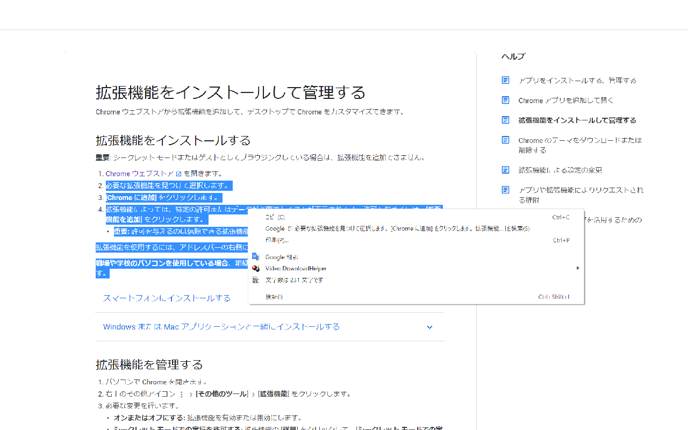

# Mojisu Counter (**JP**/[EN](README_en.md))

コンテキストメニュー上に選択中の文字の文字数を表示するChrome拡張機能です。
# 使い方
## Chromeウェブストア
[ここ](https://chrome.google.com/webstore/detail/mojisucounter/jkeifldhholnbiggjbdpgplbdanoepje)からブラウザに追加してください。

## 拡張機能設定
1. chrome://extensions/ にアクセスしてください。
2. デベロッパーモードをオンにしてください。
3. 「パッケージ化されていない拡張機能を読み込む」からダウンロードしたファイルを読み込んでください。

# ライセンス
Copyright (c) 2021 Negima1072.

This program is under MIT License (see `LICENSE` file).

# 著者
Negima1072 ([@Negima1072](https://twitter.com/Negima1072))