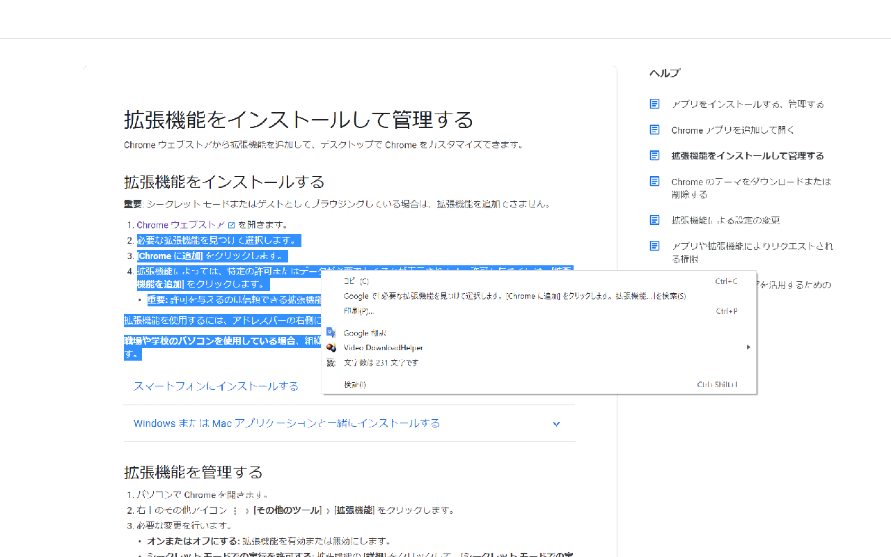

# Mojisu Counter ([JP](README.md)/**EN**)

A Chrome extension that displays the number of selected characters on the context menu.

# Usage
## Chrome Web Store
Add it to your browser from [here](https://chrome.google.com/webstore/detail/mojisucounter/jkeifldhholnbiggjbdpgplbdanoepje).

## Extensions Setting
1. Access chrome://extensions/
2. Turn on developer mode
3. Load the file downloaded from "Loading an unpackaged extension"

# License
Copyright (c) 2021 Negima1072.

This program is under MIT License (see `LICENSE` file).

# Author
Negima1072 ([@Negima1072](https://twitter.com/Negima1072))